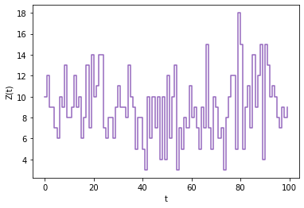

=========================
Birth-and-death Processes
=========================
BirDePy is built for analyzing general `birth-and-death processes <https://en.wikipedia.org/wiki/Birth-and-death_process>`_. 
These `continuous-time Markov chains <https://en.wikipedia.org/wiki/Continuous-time_Markov_chain>`_ (CTMCs) are widely used to study how the number of individuals in a population changes over time.
Let :math:`Z(t)` denote the size of a population at time :math:`t\ge0`; the process :math:`Z\equiv (Z(t),\,t\ge0)` evolves on the state space :math:`\mathcal S = (0,1,\dots,N)`, where :math:`N` may be infinite. 
We assume that the evolution of such a process is fully described by non-negative real-valued functions :math:`\lambda_z(\boldsymbol\theta) : \mathcal S \to \mathbb R_+`  and :math:`\mu_z(\boldsymbol\theta) : \mathcal S \to \mathbb R_+` of the current state :math:`z`; these functions are known as the population 'birth-rate' and  'death-rate', respectively. 
The model has a finite number of real parameters recorded in the vector :math:`\boldsymbol\theta`. 
When :math:`Z(t)=z`, the time until the process transitions to another state is exponentially distributed with mean :math:`(\lambda_z(\boldsymbol\theta)+\mu_z(\boldsymbol\theta))^{-1}` (where we define :math:`1/0=\infty`). 
At a transition time from state :math:`z`, the process jumps to state :math:`z+1` with probability :math:`\lambda_z(\boldsymbol\theta)/(\lambda_z(\boldsymbol\theta)+\mu_z(\boldsymbol\theta))`, or to state :math:`z-1` with probability :math:`\mu_z(\boldsymbol\theta)/(\lambda_z(\boldsymbol\theta)+\mu_z(\boldsymbol\theta))`. 

As summarized below, we consider selected birth-and-death models of three types: (i) some variants of the linear BDP, (ii) some PSDBDPs, and (iii) some queueing models.  

.. list-table:: Transition rates and parameters for :math:`z \geq 0`. Any rates which take on a negative value are modified to be equal to 0, and :math:`1_{\{A\}}` is the indicator of the event :math:`A`. When parameters are used in BirDePy they should be listed in the order they are given in the last column. 
   :widths: 18 20 20 25
   :header-rows: 1

   * - Model label
     - :math:`\lambda_z(\boldsymbol\theta)`
     - :math:`\mu_z(\boldsymbol\theta)`
     - :math:`\boldsymbol\theta`
   * - :code:`'linear'`
     - :math:`\gamma z`
     - :math:`\nu z`
     - :math:`\gamma`, :math:`\nu`
   * - :code:`'linear-migration'`
     - :math:`\gamma z + \alpha`
     - :math:`\nu z`
     - :math:`\gamma`, :math:`\nu`, :math:`\alpha`
   * - :code:`'pure-birth'`
     - :math:`\gamma z`
     - :math:`0`
     - :math:`\gamma`
   * - :code:`'pure-death'`
     - :math:`0`
     - :math:`\nu z`
     - :math:`\nu`
   * - :code:`'Poisson`
     - :math:`\gamma`
     - :math:`0`
     - :math:`\gamma`
   * - :code:`'Verhulst'`
     - :math:`\gamma\left(1-\alpha z\right) z`
     - :math:`\nu\left(1+\beta z\right)z`
     - :math:`\gamma`, :math:`\nu`, :math:`\alpha`, :math:`\beta`
   * - :code:`'Ricker'`
     - :math:`\gamma z \exp\left(-(\alpha z)^c \right)`
     - :math:`\nu z`
     - :math:`\gamma`, :math:`\nu`, :math:`\alpha`, :math:`c`
   * - :code:`'Hassell'`
     - :math:`\frac{\gamma z}{(1+\alpha z)^c}`
     - :math:`\nu z`
     - :math:`\gamma`, :math:`\nu`, :math:`\alpha`, :math:`c`
   * - :code:`'MS-S` 
     - :math:`\frac{\gamma z}{1+ \left(\alpha z\right)^c}`
     - :math:`\nu z`
     - :math:`\gamma`, :math:`\nu`,  :math:`\alpha`, :math:`c`
   * - :code:`'Moran'`
     - :math:`\frac{N-z}{N}\left(\alpha\frac{z}{N}(1-u) + \beta\frac{N-z}{N}v\right)`
     - :math:`\frac{z}{N}\left(\beta\frac{N-z}{N}(1-v) +\alpha\frac{z}{N}u\right)`
     - :math:`\alpha`, :math:`\beta`, :math:`u`, :math:`\nu`, :math:`N`
   * - :code:`'M/M/1'`
     - :math:`\gamma`
     - :math:`\nu I_{\{z > 0\}}`
     - :math:`\gamma`, :math:`\nu`
   * - :code:`'M/M/inf'`
     - :math:`\gamma`
     - :math:`\nu z`
     - :math:`\gamma`, :math:`\nu`
   * - :code:`'loss-system'`
     - :math:`\gamma I_{\{z < c\}}`
     - :math:`\nu z`
     - :math:`\gamma`, :math:`\nu`, :math:`c`

A *linear* BDP models the evolution of a population in which individuals give birth and die independently of each other and of the current population size.  
The birth and death rates *per individual* are given by some strictly positive constants :math:`\gamma` and :math:`\nu`, respectively, leading to linear *population* birth and death rates :math:`\lambda_z(\boldsymbol{\theta})=\gamma z` and :math:`\mu_z(\boldsymbol{\theta})=\nu z`. 
If, in addition, individuals immigrate at rate :math:`\alpha` into the population, the birth rate becomes :math:`\lambda_z(\boldsymbol{\theta})=\gamma z+\alpha`.  
A pure birth process, also called *Yule* process, is obtained by setting the death rate :math:`\nu` to zero, and a pure death process is obtained by setting the birth rate :math:`\gamma` to zero.
The *Poisson process* is a particular pure birth process in which the birth rate :math:`\lambda_z(\boldsymbol{\theta})`, also called *arrival* rate, does not depend on the current population size :math:`z`. 

In contrast to linear birth-and death processes, in a PSDBDP the birth and death rates per individual depend on the current population size :math:`z`. 
This feature allows us to model competition for resources such as food or territory. The birth (respectively death) rate per individual is typically a decreasing (respectively increasing) function of :math:`z`; this leads to *logistic growth* of the population (S-shaped trajectories), which tend to fluctuate around a threshold value called the *carrying capacity*. 
One of the most popular logistic models is the *Verhulst model*, which has been reinvented several times since it first appeared in 1838. 
In this model, the birth and death rates per individual are linear functions of :math:`z`. 
The *Susceptible-Infectious-Susceptible* (SIS) *epidemic model* is a particular case of the Verhulst model with :math:`\beta=0`, implying the death (recovery) rate per individual does not depend on :math:`z`.  
Other classical models of logistic growth include the *Ricker model*, in which the birth rate decreases exponentially in :math:`z`, and the *Hassell* and *MaynardSmith-Slatkin* (MS-S) models, in which the birth rate decreases according to a power law (here we assume that the death rate in these models is  independent of the population size).  
Despite the apparent similarity between the Hassell and the MS-S models, the MS-S model is thought by some to be more flexible and better descriptive form than the Hassell model. 
The particular case where :math:`c=1`, called the *Beverton-Holt* (B-H) model, is also widely used, in particular as a model for exploited fish populations. Finally, the *Moran process* models the change in the numbers of particles of two types in a finite population of size $N$, where transitions between types occur at a rate proportional to the number of potential contacts between members of each type in a population; this is an important model for genetic evolution.

In classical queueing models, the population birth rate :math:`\lambda_z(\boldsymbol{\theta})` does not depend on :math:`z`: births (arrivals) occur according to a point process, and once in the population (system), individuals queue to be served by one or multiple servers. 
The 'M/M/1' and 'M/M/:math:`\infty`' queues have arrivals occurring according to a Poisson process and, respectively, a single server and an infinite number of servers (acting in parallel and independently). 
In a *loss system*, arrivals can only occur when the population is below a certain threshold value :math:`c`.

Custom Models
-------------
It is possible to specify custom birth and death rates for the five core BirDePy functions. This is achieved by specifying the argument of `model` as 'custom' and passing as kwargs the callables `b_rate` and `d_rate`.  Each of these callables must take as input a population size 'z' and a list of parameters 'p', and respectively return scalars :math:`\lambda` and :math:`\mu` corresponding to the birth and death rates: ``b_rate(z, p) -> \lambda``, ``d_rate(z, p) -> \mu``. 

As an example we will consider a process with :math:`\lambda_z(\boldsymbol\theta) = \gamma z` and :math:`\mu_z(\boldsymbol\theta) = \nu z^2`. 

If not already done, first install BirDePy (as described :ref:`here <BirDePy: Birth-and-death Processes in Python>`). 
Then import BirDePy::

    import birdepy as bd

Now specify custom birth and death rates::

    def custom_b_rate(z, p): return p[0] * z
    def custom_d_rate(z, p): return p[1] * z**2

Suppose that :math:`\gamma = 5`, :math:`\nu = 0.5` and :math:`Z(0)=10`. To simulate a trajectory::

    obs_times = [t for t in range(25)]
    pop_sizes = bd.simulate.discrete([5, 0.5], model='custom', z0=10, times=obs_times,
                                     b_rate=custom_b_rate, d_rate=custom_d_rate, seed=2021)

The trajectory can be plotted using Matplotlib::

    import matplotlib.pyplot as plt

    plt.step(obs_times, pop_sizes, 'r', where='post', color='tab:purple')
    plt.ylabel('Z(t)')
    plt.xlabel('t')
    plt.show()

For example: 

The parameters can then be estimated from the simulated sample path:: 

    p_bounds = [[0,10], [0,10]]
    est = bd.estimate(obs_times, pop_sizes, [1, 1], p_bounds, model='custom',
                      b_rate=custom_b_rate, d_rate=custom_d_rate)
    print(est.p)

Which displays the estimate::

  [7.029076385718105, 0.6961996442136139]
